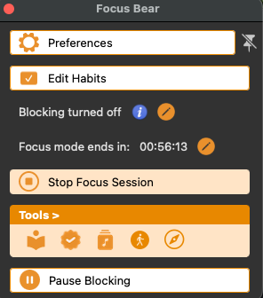
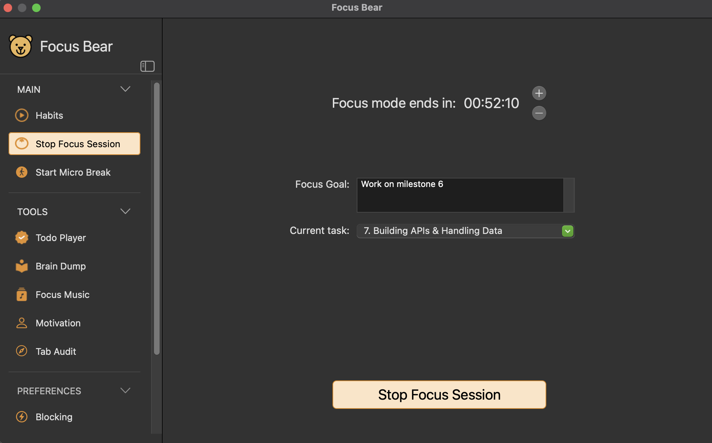
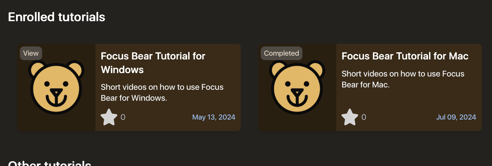
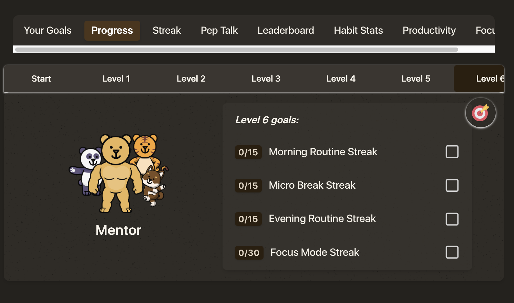
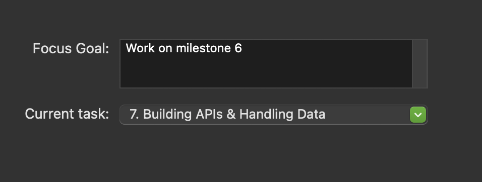

# Reflection
### Why do you think Focus Bear was created?
Focus Bear was created to help people struggling with internet addiction, ADHD and Autism (and others with procrastination or distraction issues) to better navigate screen use and productivity. It was created with the intention to help these users focus on wellbeing and productivity by a team passionate about and understanding of the issues these people face.

### What problem is Focus Bear solving?
Focus Bear aims to solve issues facing particularly those with ADHD/ASD - as well as students and others trying to increase their productivity and wellbeing. While other wellbeing and productivity apps offer many features, none of them hollistically combine distraction blocking, productivity tracking and wellbeing support like Focus Bear. In this way, Focus Bear is solving the issue of having to utilise various applications or methods to achieve overall digital and phsycial wellbeing and effective productivity. This is particularly important for those with ADHD/ASD that struggle to manage and switch between various tasks and manage overwhelming information.

### Why do you think this mission is important?
Focus Bear's mission is important, because those with ADHD/ASD deserve to have the tools and support to achieve what their neurotypical peers are able to as well. Those with ADHD/ASD are often overlooked and their struggles dismissed as being due to "laziness" or "not trying hard enough", while in reality they face difficulties that neurotypical people do not. Focus Bear's mission to help these people is important becuase by developing these tools, Focus Bear is contributing to increased access and support for ADHD/ASD people and helping them to reach their full potential.

### How does Focus Bear’s work align with your personal values or interests?
Studying compuer science, I obviously have an interest in software development and production. In this way, Focus Bear's work aligns with my interests academically and career-wise.

More importantly however, Focus Bear's work aligns very closely with my values and goals as a person. As an autistic person, I am passionate about increasing accessibility and awareness. Particularly, I am passionate about helping fellow neurodivergent people because I understand the struggles and difficulties this group faces and the common misconceptions others have about neurodivergence. I have a range of interests in terms of career goals, but I would absolutely love to help develop something to help disabled or disadvantaged people in some way, and Focus Bear's work aligns with this exactly. I also feel that by bringing a lived experience with me, I can approach projects with a deeper understanding and passion for the outcome, as my personal values and interests are so closely aligned with Focus Bear's goals.

### Do you personally relate to any of the challenges that Focus Bear aims to solve?
I absolutely do; I am an autistic person, so I experience a lot of the issues Focus Bear aims to solve. Though I do not struggle so much with distractability and productivity, I do experience a lot of information overwhelm, executive dysfunction, and decision fatigue. Focus Bear's unique integration of wellbeing tools such as habit tracking with focus sessions directly aims to solve these issues I experience, where problems with executive dysfunction can be aided by setting up habtis for selfcare and management.

Additionally, my partner of 5 years struggles with ADHD, so where I don't expereince a lot of the attention-related struggles Focus Bear aims to address, I can sympathise with these issues and have first-hand experience seeing how these struggles can affect someone in day-to-day life.

# Using Focus Bear
## Screenshots
**Popup**

When first using the app, I found it a bit confusing on what triggers this popup; It doesn't seem to follow any logic (to me at least). Sometimes when I go to open Focus Bear, the full application opens, and sometimes it is just this popup. I Also was confused on how to navigate to the main application when this popup opens. I now understand I can select one of the listed options and the full app will open, but I would prefer a dedicated "go to application" button or for the full app to open automatically.

**Breaks**

One of the features I really wanted to try using was the pomodoro timer while in focus mode. When I select "start focus session", the interface lets me choose how many minutes of breaks I want for the time I aim to focus for. However, throughout the session, I don't get any prompts to take a break, the session just extends for the full time I set. I still don't understand how to setup the pomodoro timer.

**Tutorial**

When I first downloaded the app, I had wished there was a guided tutorial, as I felt quite lost. Upon exploring the app, I found the tutorials tab and selected the mac option. However, when I open the mac tutorial, it tells me I've already completed it. I don't remember seeing any tutorial - or perhaps I skipped it and forgot? Either way, I wish there was a way to retake the tutorial, as I still feel a bit lost navigating the application.

**UI**

This is a very minor thing, but from a QA perspective, some of the UI seems a little unpolished. For example, having headings or content cut off, like the "level 6" seen above.

**Focus Goal**

Lastly, I am a bit confused with some of the options when starting a focus session. For example, how does my "focus goal" interact with my "current task"? Is it related to my to-dos? I feel like I needed an explicit explaination of these different terms and options to fully understand how each thing operates in the app.
