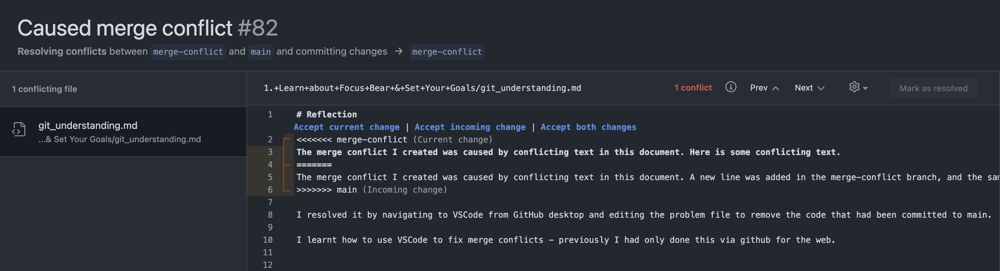

# Reflection
The merge conflict I created was caused by conflicting text in this document. A new line was added in the merge-conflict branch, and the same line was changed in the main branch - causing a conflict.

I resolved it by navigating to VSCode after seeing the conflict on Github, and editing the problem file to remove the code that had been committed to main.

Here is an image detailing the conflict I created:

I learnt how to use VSCode to fix merge conflicts - previously I had only done this via github for the web.

