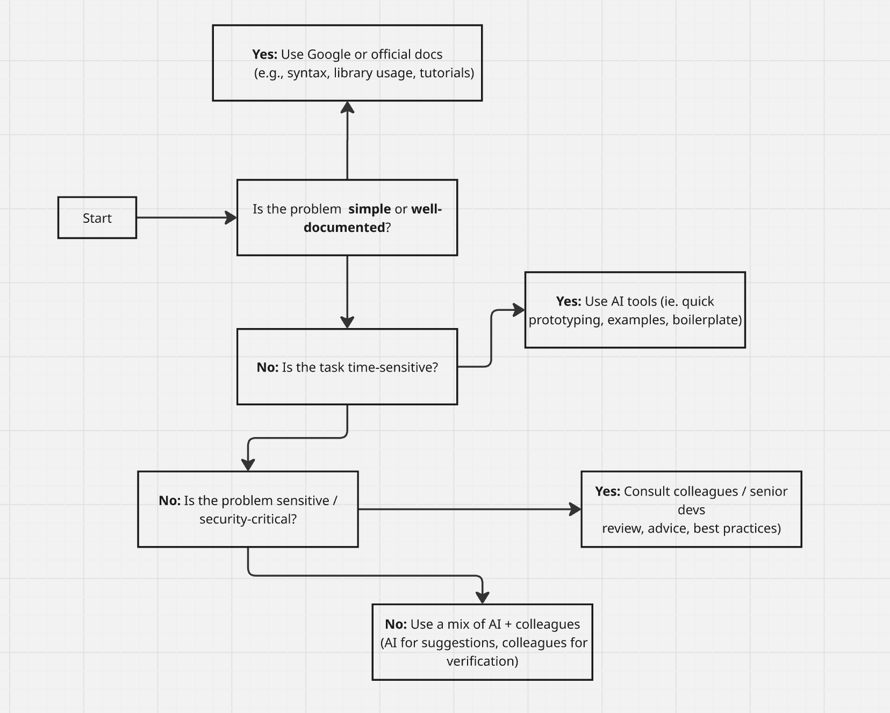

# Research best practices for troubleshooting coding problems.
## When is it helpful to use AI in coding and when is it not?
AI is best for speeding up repetitive coding, generating examples, and learning, but human oversight is crucial for architecture, security, and project-specific logic. Think of AI as a smart coding assistant, not a replacement for careful developer judgment.

# Develop a decision-making framework
## Flowchart

# Reflection
## When do you prefer using AI vs. searching Google?
I prefer to use AI when my questions are very context-heavy; when factors such as dependencies or specific goals would make general advice from Google less helpful. However, I would look for resources via Google and sites like StackOverflow when the problem I am facing is more general, and based on a skills gap.

## How do you decide when to ask a colleague instead?
I will ask a colleague for help when I feel that I have exhausted options given to me by Google and AI, or that these tools will not be helpful based on the specificity of the issue. Additionally, if the issue is security-based or otherwise sensitive, asking a colleague may be better.

## What challenges do developers face when troubleshooting alone?
Without collaboration, it’s easy to get stuck in “tunnel vision”, repeatedly checking the same code or assumptions without noticing the real issue. They may also lack perspective or experience with certain libraries, frameworks, or edge cases, making it harder to identify root causes. Furthermore, debugging complex systems alone can be overwhelming, especially when the problem involves multiple layers and someone (sucha as myself) with less experience is trying to approach the issue.
