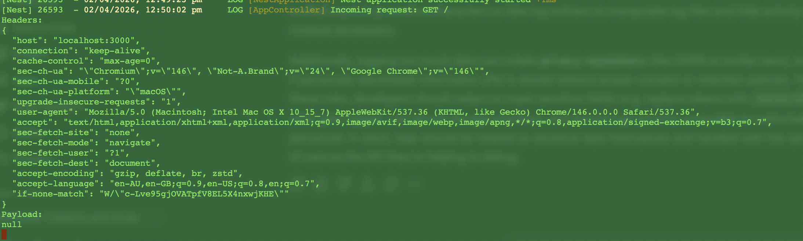
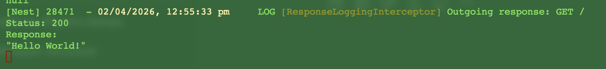

# Reflection
## How can logging request payloads help with debugging?
Logging request payloads is extremely useful for debugging because it shows exactly what data the server is receiving during authentication flows. Many issues arise from mismatches betweenfrontend and  backend, such as missing or incorrectly formatted authorization headers. By inspecting logged payloads, developers can quickly identify whether a token is present, whether it follows the expected format, and whether key fields are missing or incorrect. This is especially helpful for diagnosing JWT-related problems like invalid audiences or issuers. Ultimately, payload logging reduces guesswork by providing a clear view of incoming requests and makes it easier to pinpoint and fix authentication errors.

## What tools can you use to inspect API requests and responses?
Tools such as Bruno, Postman and curl are commonly used to inspect API requests and responses.

## How would you debug an issue where an API returns the wrong status code?
On the backend, add logging or breakpoints to follow the request lifecycle. This means checking controllers, services, and especially guards or middleware that might be altering the response. You should verify that exceptions are being handled correctly, and if you’re using authentication with Auth0, confirm that token validation isn’t failing silently and triggering the wrong response. Any global interceptors or filters that may override responses should also be checked. By systematically checking the client request, server logic, and error handling, you can pinpoint where the wrong status code is introduced and fix it.

## What are some security concerns when logging request data?
Request logs can accidentally capture things like access tokens, refresh tokens, passwords, or personal user data. If these logs are stored or accessed improperly, they can be used to hijack accounts or compromise user privacy. Log storage and access control are also potential issues; if logs aren’t encrypted or are accessible to too many people, they become a valuable target for attackers. There’s also a risk of log injection attacks, where malicious users include crafted input (e.g. newline characters or fake log entries) to manipulate log files and hide activity or mislead developers.

# Tasks
## Research tools for inspecting API requests (Bruno, Postman, or curl)
I have used all these tool over the course of my onboarding, and previously would primarily use Postman. However, I now prefer Bruno as it is more lightweight, file-based, and integrates with my development workflows such as utilising GitHub.

## Log request payloads and headers in a NestJS controller
I updated the controller in my nestjs-auth0-api to log request headers and payload for each existing route using Nest’s built-in Logger in app, as seen in the screenshot below.

## Inspect API responses and verify HTTP status codes & using middleware or interceptors to modify and analyze API responses
I did this by updating the project with an interceptor for outgoing responses, which for every HTTP requestm logs the request method and URL, the final HTTP status code, and the outgoing response body.

