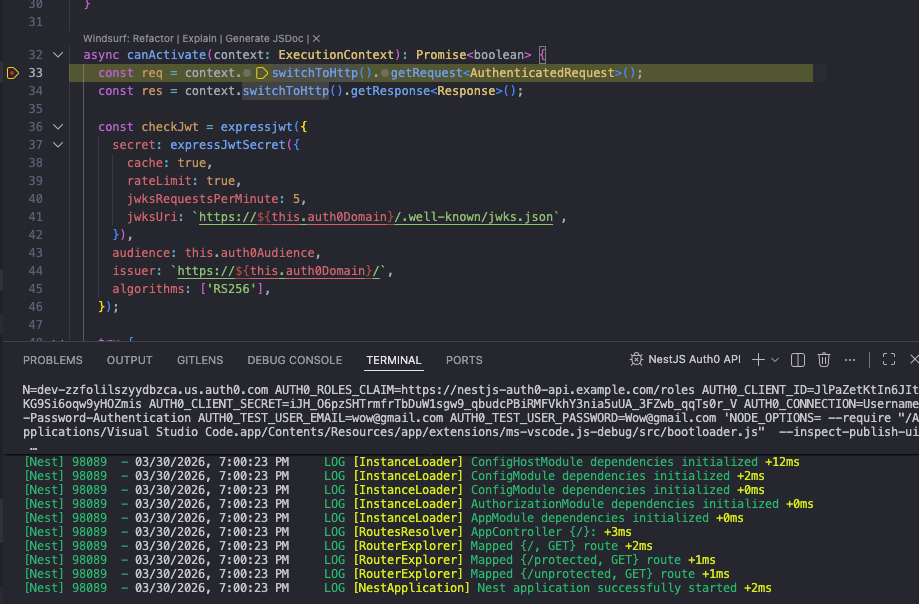

# Reflection
## How do breakpoints help in debugging compared to console logs?
They allow you to run a program up until the point where a bug is suspected to be. Then, they give you the opportunity to step through the logic line-by-line. Comparitvely, console logs will only show if/when lines of code are being executed, but do not let you follow the logic along in real time and inspect variable values.

## What is the purpose of launch.json, and how does it configure debugging?
The launch.json file in Visual Studio Code defines how your application should be run and debugged. It provides configuration settings that tell VS Code how to start or attach to a process, what command to run, which runtime to use, and how to connect the debugger. It can also specify things like environment variables, working directory, and files to ignore during debugging. By centralizing these settings, launch.json allows you to consistently start debugging sessions, set breakpoints, and inspect your code without manually configuring the runtime each time.

## How can you inspect request parameters and responses while debugging?
You inspect request parameters and responses by setting breakpoints in your controller or service, then using VS Code’s debugger tools (such as the variables panel, hovering over variabes, and the debug console) to examine incoming request data and outgoing response values while execution is paused.

## How can you debug background jobs that don’t run in a typical request-response cycle?
To debug them, you run the application or worker process in debug mode, then set breakpoints inside the job’s processing functions. You can trigger the job manually if needed to step through its logic, and while paused, use VS Code’s debugger to inspect the job payload, service outputs, and any dependencies. Combining breakpoints with detailed logging can also help trace the execution of long-running or recurring jobs effectively.

# Tasks
I set up a launch.json with three configs for debugging the application in nestjs-auth0-api:

- NestJS Auth0 API: to run the app from src/main.ts
- Auth0 Login Helper: to debug user/first.ts
- Auth0 Verify Protected Route: to debug user/second.ts

I then tested these configs by running the application with the debugger and breakpoints (both in a service and controller), such as the one pictured below.

