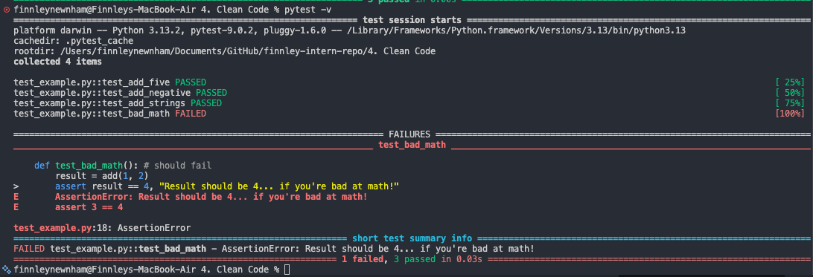
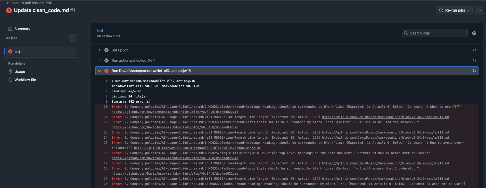
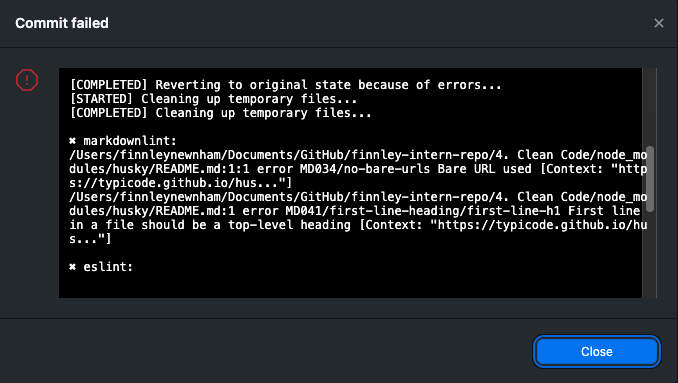

# Naming Conventions

## An example of messy code

```python
def f(a,b):
 r=0
 for i in a:
  if i>3:
   if b:
    r+=i*2
   else:
    r+=i
  else:
   if i==1:r+=5
   else:r+=i-1
 return r
 ```

The above shows a bad example in python. This example features unreadable variable names, confusing nested logic, hard coded numbers, and difficult-to-understand intent.

### Refactored code

```python
def calculate_score(numbers, double_large_values):
    score = 0

    for number in numbers:
        if number > 3:
            if double_large_values:
                score += number * 2
            else:
                score += number
        else:
            if number == 1:
                score += 5
            else:
                score += number - 1

    return score
```

This refactored code is much more readable. The variable names are descriptive and humnan-readable. The logic is still a bit convoluted, but it is much easier to understand.

## Naming conventions

### What makes a good variable or function name?

A good variable name indicates what the variable is used for, and perhaps its type. Depending on the language, the variable name might also suggest how it's used or its access level - for example, in C# a variable name beginning with an underscore is often used to indicate a private variable.

A good function name should indicate what the function does, and perhaps its return type or any side effects it has. The variables taken as parameters should also be indicitive of what purpose they serve and be readable when used within the function.

### What issues can arise from poorly named variables?

Poorly named variables make code difficult to read and understand. It may mean developers need to constantly read through code to infer what a variable's purpose is, and can cause confusion. It can lead to bugs if varibles are misused or if developers' have confluicting understandings of what the variable is used for, or if naming conventions (such as a capital letter for a class in C#) are not followed.

### How did refactoring improve code readability?

As seen above, the refactored code is much easier to understand. The variable names have actual meaning, and don't require any further reading to use confidently. They also suggest the type of data they hold ("numbers" suggests a list or array containing int or float values). By formatting the code with indentation and spacing, it also makes the logic easier to follow, and means someone reading the new code doesn't have to keep track of what variables mean while also trying to understand the logic.

# Functions

## Bad example

```python
def attack(attacker, victim, weapon):
    # calculate damage
    if weapon == "sword":
        damage = 15
    elif weapon == "bow":
        damage = 10
    else:
        damage = 5

    # apply damage
    victim["hp"] -= damage
    print(attacker["name"], "hits", victim["name"], "for", damage)

    # check if victim died
    if victim["hp"] <= 0:
        victim["hp"] = 0
        attacker["score"] += 100
        print(victim["name"], "died! +100 points")
    else:
        attacker["score"] += 10
        print("+10 points")
```

## Good example

```python
def attack(attacker, victim, weapon):
    damage = calculate_damage(weapon)
    apply_damage(attacker, victim, damage)
    check_victim_died(attacker, victim)

def calculate_damage(weapon):
    if weapon == "sword":
        return 15
    elif weapon == "bow":
        return 10
    else:
        return 5

def apply_damage(attacker, victim, damage):
    victim["hp"] -= damage
    print(attacker["name"], "hits", victim["name"], "for", damage)

def check_victim_died(attacker, victim):
    if victim["hp"] <= 0:
        victim["hp"] = 0
        attacker["score"] += 100
        print(victim["name"], "died! +100 points")
    else:
        attacker["score"] += 10
        print(victim["name"], "hit for 10 points")
```

### Why is breaking down functions beneficial?

Breaking down functions is beneficial because it creates more reusable, modular code. With this approach, you are less likely to depend on code duplication, as you can use small and versatile functions across your codebase. It can also make code more readable and easier to understand, by breaking down logic into more specific functions. This will also help scalability, as you can start with many small and simple functions and build out their complexity, as opposed to constantly needing to refactor large and complicated functions.

### How did refactoring improve the structure of the code?

Refactoring the example code made it easier to read; the logic is now easier to follow and feels more natural. Having split the code into smaller functions also makes it more modular and reusable. Now, if the logic in these bite-sized functions was needed in a different project, it is easy to import the file and utilise them rather than rewriting the same code.

# Repeated Code

## Duplicate code

```python
    def process_order(order, user_type):
        total = sum(order["items"])

        # apply discount
        if user_type == "member":
            total *= 0.9

            # duplicated shipping logic
            if total > 50:
                shipping = 0
            else:
                shipping = 5

        else:
            # duplicated shipping logic again
            if total > 50:
                shipping = 0
            else:
                shipping = 5

        final_price = total + shipping
        print("Total:", final_price)
```

## Refactored code

```python
    def process_order(order, user_type):
        total = sum(order["items"])

        # apply discount
        if user_type == "member":
            total *= 0.9

        shipping = calculate_shipping(total)
        final_price = total + shipping
        print("Total:", final_price)

    def calculate_shipping(total):
        if total > 50:
            return 0
        else:
            return 5
```

### What were the issues with duplicated code?

Duplicated code can cause bugs and difficult-to-read and maintain code. If you are calling the same logic from multiple places, when you change one instance, the other remains. This it will appear as though only some of the intended changes worked, while seemingly for no reason, other aspects of your code are behaving differently. It can be diffiuclt to trace where the issue is, and wastes time as you must update the same code in multiple places, or spend time following the code to debug the issue.

### How did refactoring improve maintainability?

By refacorting code, you improve maintainability by ensuring developers all know what logic is being used across the codebase, and making it so changes must only be applied to one instance of the code. Eliminating duplicated code reduces time spent debugging and thus helps improve maintainability. Additionally, now the seperate function can be used elsewhere in the codebase, rather than perpetuating the problem of duplicated code by rewriting it again.

# Comments

### When should you add comments?

Comments should be added when the code is doing something non-obvious, or if there is some important context that a developer may not know. For example, if you are using a specific algorithm that may not be commonly known or complex math (such as delta time or radians in game dev), it would be good to add a explaining comment and your intention behind using it. Additionally, if there are any edge cases or gotchas that a developer may not be aware of, it would be good to add comments explaining these.

### When should you avoid comments and instead improve the code?

Comments should not be used as a substiute for good naming convections or code structure; for example, if you just call a variable "x" and then write a comment to explain what "x" is, it would be far better to simply rename the variable, to improve readability. Additionally, if you have "spaghetti code" with a lot of nested and concoluted logic, instead of commenting paragraphs to explain the flow of logic, it would be better to refactor the code.

# Errors and Edge Cases

## Bad example

```python
def withdraw(account, amount):
    # subtract money
    account["balance"] -= amount

    # print result
    print("Withdrew", amount)
    print("New balance:", account["balance"])

    # warn if negative
    if account["balance"] < 0:
        print("Warning: account is overdrawn")
```

## Good example

```python
def withdraw(account, amount):
    # guard clauses to handle edge cases and errors
    if account is None: raise ValueError("Account cannot be None")
    if amount <= 0: aise ValueError("Amount must be a positive number")

    account["balance"] -= amount
    print("Withdrew", amount)
    print("New balance:", account["balance"])

    # we still allow overdrawing
    if account["balance"] < 0:
        print("Warning: account is overdrawn")
```

### What was the issue with the original code?

The original code had no logic for handling invalid input or edge cases. Users could input a negative amount to withdraw, which would actually increase their balance. Additionally, if the account was None, it would throw an error when trying to access the balance and crash the application.

### How does handling errors improve reliability?

By handling errors, you can prevent your application from crashing due to invalid input or unexpected edge cases. This improves the reliability of your application, as it can gracefully handle issues rather than breaking - for example, by providing informative error messages to users and allowing them to re-enter their input.

# Overly-complicated code

## Bad example

```python
def can_buy_ticket(user):
    if user["age"] >= 18:
        if user["has_id"] == True:
            if user["banned"] == False:
                return True
            else:
                return False
        else:
            return False
    else:
        return False
```

## Good example

```python
    def can_buy_ticket(user):
        return user["age"] >= 18 and user["has_id"] and not user["banned"]
```

### What made the original code complex?

The original code had many nested if statements and unnessary retuns. It is difficult to understand the logic and what varibale values lead to what outcomes.

### How did refactoring improve it?

The refactored code is now one line and very easy to understand; it is clear what conditions a user must meet to buy a ticket.

# Code Smells

## Bad example

```python
def process_purchase(user, items, is_member):
    total = 0

    # calculate total
    for i in range(len(items)):
        total = total + items[i]["price"] * items[i]["qty"]

    # apply member discount
    if is_member == True:
        total = total * 0.9
    else:
        total = total

    # shipping calculation
    if total > 50:
        shipping = 0
    else:
        shipping = 5

    # duplicated shipping logic
    if user["country"] != "Australia":
        if total > 50:
            shipping = 0
        else:
            shipping = 5

    # random logging
    print("USER:", user["name"])
    print("TOTAL:", total)

    # magic number tax
    total = total * 1.1

    return total + shipping
```

## Good example

```python
def process_purchase(user, items, is_member):
    subtotal = calculate_total(items, is_member) * GST_RATE
    total = subtotal + calculate_shipping()

    return total

def calculate_total(items):
    total = 0
    for i in range(len(items)):
        total = total + items[i]["price"] * items[i]["qty"]

    if is_member:
        total = total * MEMBER_DISCOUNT

    return total

def calculate_shipping(total):
    shipping = 0
    if total <= 50:
        shipping = 5
    return shipping
```

### What code smells did you find in your code?

The original code had duplicated shipping code, magic numbers for tax and member discount, unnecessary comments, and random logging that didn't fit with the rest of the function. The function also has multiple responsibilities, including logic that may be useful in other places of the program.

### How did refactoring improve the readability and maintainability of the code?

The code is far more readable now the different pieces of logic are broken into smaller modular functions. The magic numbers are now appropriately named constants, which makes this code much easier to understand for a new user. Unnecessary comments that just restate what can be easily understood from the code have been removed, which also improve readability. The random logging has been removed, as it doesn't fit with the rest of the function and would be better suited to be added in a different place if needed - such as a seperate function for debugging. Also, by refactoring the logic into modular functions, these pieces of logic can now be used elsewhere in the program without having to write duplicate code.

### How can avoiding code smells make future debugging easier?

Avoiding code smells makes debugging easier by ensuring logic is easy to follow and quick to read. Particularly, by renaming magic numbers to readable constants, this will reduce the necessary debugging by ensuring if these values change, one instance of them isn't accidently missed. Overall, avoiding code smells just leads to code that is quick to read and easy to understand, which means when debugging is necessary, it is much quicker to do.

# Code Formatting and Style Guides

### Why is code formatting important?

Code formatting is improtant as it ensures thedevelopment team are all able to understnad the meanings behind names. For example, constants should be in ALLCAPS, while local variables should be lowercase, and functions should be named using camelCase. Standards such as these ensure code is readable and developers know the meanings of all names within a codebase. Additionally, formatting such as spaceing and tabbing makes code easy to read and speeds up development time by ensuring this.

### What issues did the linter detect?

The linter detected issues such as improper indentation and spacing that made code difficult to read.

### Did formatting the code make it easier to read?

Along with formatting, the linter made the code much easier to read.

# Unit Tests

## Example test output



### How do unit tests help keep code clean?

Unit tests help keep code clean by ensuring any bugs are caught quickly by running the unit tests. They may also disuade developers from having to include messy debugging messages in the main code, as the unit tests can instead include debug messaging and flags.

### What issues did you find while testing?

I found an issue with the final test I wrote, where the 'add' function was not producing the output expected by the test. This is a primitive example of a test flagging an unexpected outcome, as I wrote this test to fail, but it demonstrates how unit tests can flag issues quickly and effectively.

# CD & CI

## Example workflow output





### What is the purpose of CI/CD?

The purpose of CI/CD is to both streamline and bulletproof development. By ensuring automatic checks happen throughout development, mistakes and bugs are less likely to be introduced. With this robust approach, updates and new features can then be pushed to production without having to manually review changes, speeding up development and the delivery of new content to users.

### How does automating style checks improve project quality?

Automating style checks improves project quality by ensuring style rules are applied before committing your work to the repo. This way, any new code is up to the company's standard and is easy to read, meaning overall project quality is improved.

### What are some challenges with enforcing checks in CI/CD?

Some challenges may include finicky or non-important changes being forced - for example a single whitespace issue on MD files. These may take time to solve, even if the issue does not effect the overall quality of the code.

### How do CI/CD pipelines differ between small projects and large teams?

In a small project, they are less important, as when working with fewer people it is easier to communicate and enforce standards without a CI-CD pipeline. In a larger team however, a CI/CD pipeline is a must, as managing many peoples work manually would be time consuming and inefficient.
