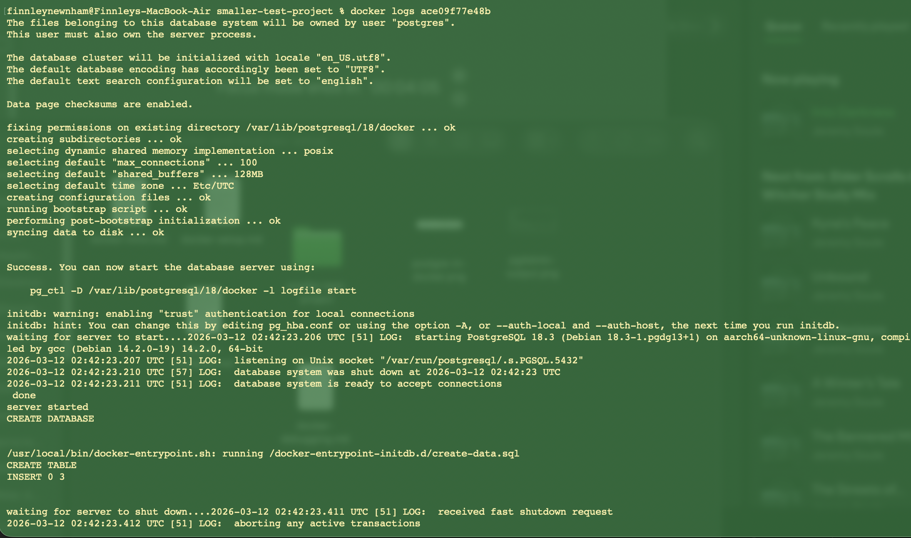
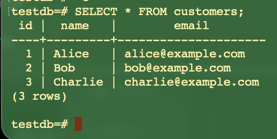

# Reflection
## How can you check logs from a running container?
### Example output

By using docker logs <container id>.

## What is the difference between docker exec and docker attach?
Docker exec opens a new command or shell within the container. You can run multiple of these and it does not take over the main process. This is usually the prefered method for running shell commands and debugging. Docker attach on the other hand uses the main process and "attaches" to the container. This can be usful for watching logs or interacting with foreground processes, but poses higher risk; if you stop the shell suddenly, the container may also exit.

## How do you restart a container without losing data?
Ensure that data is stored in a volume, and that volume is referenced in the YAML file. Then use docker restart <container-name>.

## How can you troubleshoot database connection issues inside a containerized NestJS app?
Your first point of call should be to check the env file and ensure the details are correct. Following that, enter the container and test the connectivity.

```bash
ping postgres
# or
nc -zv postgres 5432
# or
psql -h postgres -U postgres -d testdb
```
If the ping fails, it suggests a networking issue; If nc fails, the port not reachable; And if psql fails the DB credentials are incorrect or the DB is not ready.

You can also view the logs using docker logs <postgres-container> and look for " atabase system is ready to accept connections", meaning things are working as intended.

## Example output from docker exec

