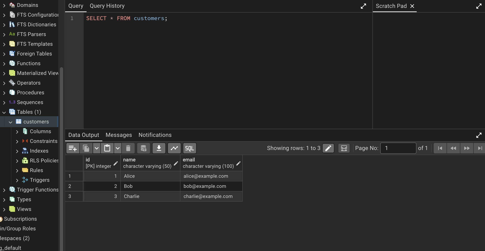

# Reflection
## What are the benefits of running PostgreSQL in a Docker container?
By running PostgreSQL in a Docker container, you can acess and test a database without having to install dependencies. By using Docker Composer, you can further improve the workflow by starting up things like a web interface and server at the same time and do robust testing without worrying about what version works with which config.

## How do Docker volumes help persist PostgreSQL data?
Docker volumes help persist PostreSQL data by keeping it seperate from the container. If the data is stored in the container, it will be deleted if the container is deleted. This way, Postgres can reattach to the files and data next time the container is built.

## How can you connect to a running PostgreSQL container
You can do this from the terminal by providing the host, port, user, database, password, etc. Alternatively, you can use a GUI such as pgAdmin and provide the same details.

### Output from tasks done
**A PostgreSQL container in Docker**

**A table created in a PostgreSQL database, populated with a Docker Volume and viewed in pgAdmin**

