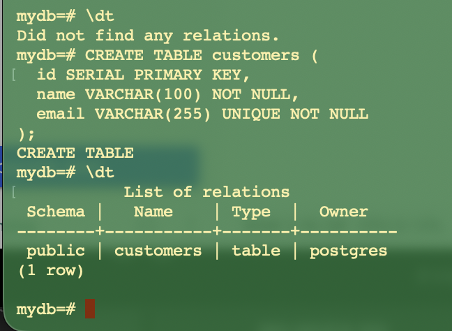
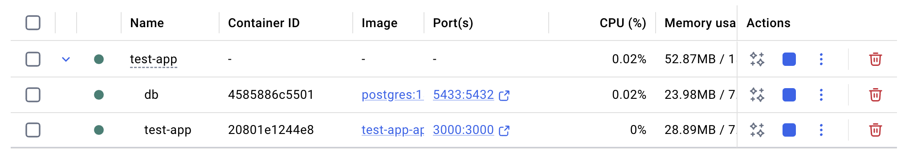
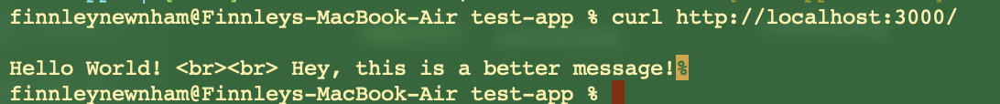

# Reflection
## How does a Dockerfile define a containerized NestJS application?
A Dockerfile defines how a NestJS application is packaged and run inside a container by specifying the environment, dependencies, and startup command needed for the application. It will usually begin with a base image, then sets a working directory for the application files. The Dockerfile copies the project’s package.json files into the container and runs npm install to install dependencies. Then, it copies the rest of the application source code into the container and may run a build step to compile the TypeScript code into JavaScript. The Dockerfile then exposes the port the NestJS server will use and runs a command to start the application.

## What is the purpose of a multi-stage build in Docker?
A multi-stage build allows for a much lighter-weight image that is quicker to run by seperating out the build process from the final runtime environment.

## How does Docker Compose simplify running multiple services together?
Docker Compose helps to manage multiple containers running concurrently that rely on eachother to opnerate - such as a Postgre database and a NestJS app. Docker compose makes it easier to work with multiple services by allowing you to start and stop multiple contains with single commands.

## How can you expose API logs and debug a running container?
You can validate API output using the curl command, and inspect container details with docker inspect. For more practical debugging, you can use logs written into yout app. When a container runs, anything written to stdout or stderr by the application (for example console.log() in a Node/NestJS API) is captured by Docker’s logging system. You can view these logs using commands like docker logs <container-name> to see the output of the running container. Adding the -f flag (docker logs -f <container-name>) lets you follow the logs in real time, which is useful for monitoring API requests and errors as they occur.

### Screenshots
**Postgres db within container**

**Postgres db within container**

**Checking API**

