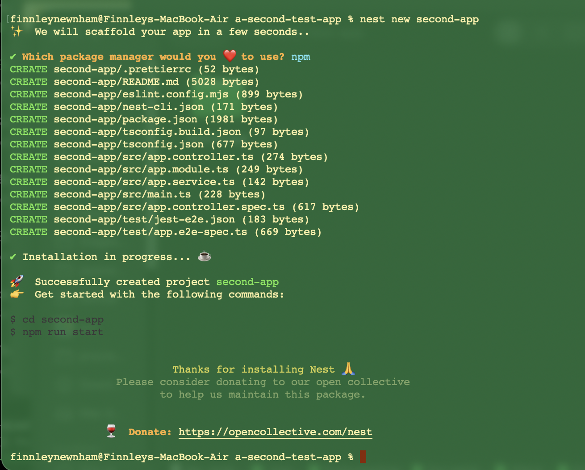
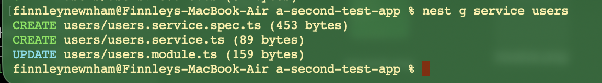
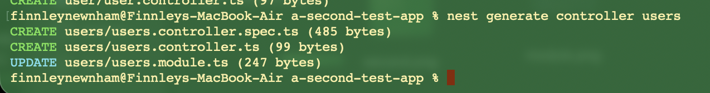

# Reflection
## How does the NestJS CLI help streamline development?
NestJS CLI helps streamline development by providing users a quick and easy way to setup the necessary parts of a NestJS project that is ready to run. By getting these files generated with the CLI, naming conventions stay adheared to and project organisation stays consistent.

## What is the purpose of nest generate?
nest generate will create the relevent files for the item specified, and add any providers to NestJS's internal array for access by other modules. This command will also update other modules in the application to ensure the new module is properly registered.

## How does using the CLI ensure consistency across the codebase?
As mentioned above, using the CLI ensures organisation and naming conventions stay consistent. This means configuration or environment issues ar less likely.

## What types of files and templates does the CLI create by default?
By default, the CLI creates a standard project structure including a root module, controller, service, and bootstrap file. The CLI also creates configuration files such as package.json, tsconfig.json, and nest-cli.json, along with a basic testing setup. By using the CLI the codebase's directory is setup in an organised way where configuration issues are unlikely.

### CLI examples
**A new project created with the CLI**

**A new module, service and controller created with the CLI**

