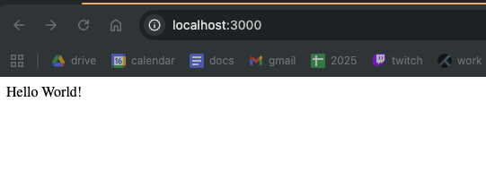
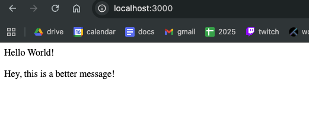
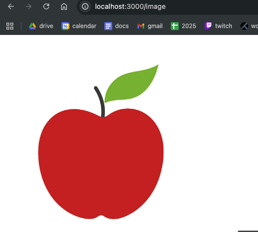

# Reflection
## What files are included in a default NestJS project?
A defult NestJS project includes a file for main.ts, along with contoller, module and service files.

## How does main.ts bootstrap a NestJS application?
main.ts bootstraps a NestJS application by importing the necessary tools to run the project. It begins by importing NestFactory to create the application object and AppModule which describes what controllers and services the app will be using. It then creates the async function bootstrap() which will call the NestFactory to build the app based on AppModule. bootstrap() is then called at the end of the file to build the application.

## What is the role of AppModule in the project?
The role of AppModule in a project is to tie all modules together. It registers the app's controller and the app's service.

## How does NestJS structure help with scalability?
The NestJS structure helps with scalability by being highly modular and well-organised. Files are organised by function into modules - rather than by name or another alternative - which makes developing functionality easy; you will not need to reorganise the project structure to accomodate growth.

## My example application
I generated the default NestJS project from the command line which produced the following:

I then explored how NestJS's controller and service objects interact by editing the app.controller file to call two methods from app.service.

### Example endpoint
This endpoint shows an image.

