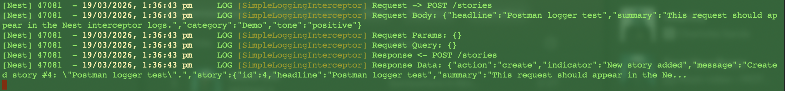

# Reflection
## What is the difference between an interceptor and middleware in NestJS?
Middleware is run before the request reaches the controller, while an interceptor runs before and after a route handler. Middleware is often used for tasks like logging, authentication checks, or modifying the request/response objects. Interceptors can also be used to transform the response data, but may also measure execution time, handle logging for *both* request and response, and can implement features like caching.

## When would you use an interceptor instead of middleware?
Interceptors are used instead of middleware when you need to handle or transform both the request and response, or apply logic around a specific route handler. Different from middleware, interceptors can run before *and* after the handler, and have access to its result. This makes them suitable for tasks like response transformation, logging, and caching.

## How does LoggerErrorInterceptor help?
A LoggerErrorInterceptor is a reusable, modular component that can be applied to multiple routes, controllers, or globally to consistently handle error logging. It helps separate concerns like logging from business logic, thus improving code maintainability.

### Implementing interceptors and middleware
**Logger interceptor**
In my basic-project application, I implemented a simple logging interceptor globally in main.ts - SimpleLoggingInterceptor(). This applies to the whole app and logs request method and URL, request body, params and query, and response data. The terminal output is as follows:

**Middleware**
I created a piece of middleware which just creates a log to the terminal when POST /stories or DELETE /stories/:id is hit. Below is the logging output when the later endpoint is hit:

[DELETE output](middleware.png)
