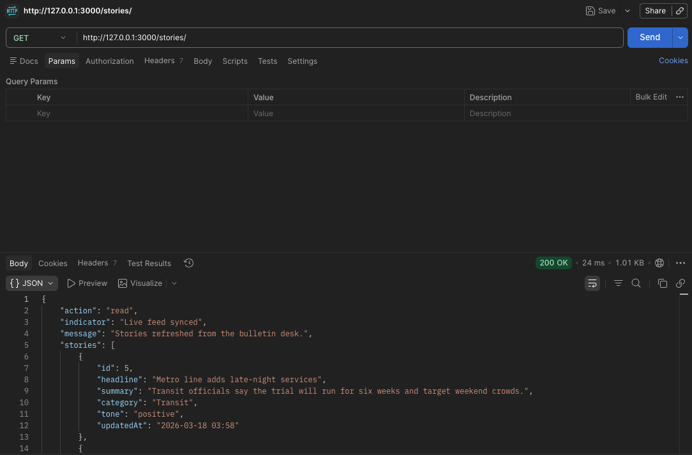
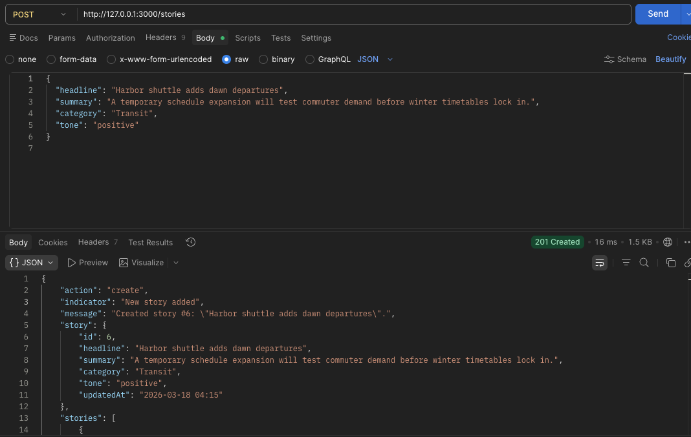
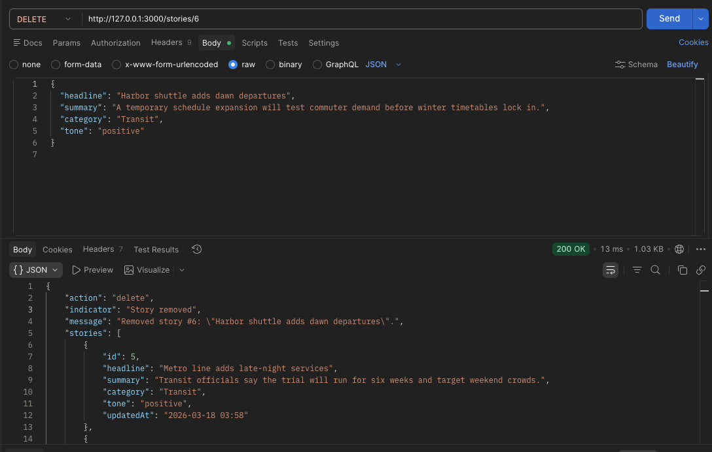

# Reflection
## What is the role of a controller in NestJS?
The controller recieves HTTP requests and implements a service to execute business logic.

## How should business logic be separated from the controller?
Business logic is separated from the controller by keeing it in services. The controller can delegate tasks to a provider or service, thus separating request handling from business logic.

## Why is it important to use services instead of handling logic inside controllers?
Handling logic inside controllers makes for unmaintainable, untestable, tightly coupled code. A service can be easily tested and reused, as it is a modular piece of logic that can be imported across the program. As an application grows, it is much easier to extend logic inside services or by creating new providers, than it is to extend logic inside a controller. For these reasons, it is important to use services instead of putting logic inside controllers.

## How does NestJS automatically map request methods (GET, POST, etc.) to handlers?
NestJS maps HTTP methods such as GET and POST to handler functions using decorators and metadata. When you annotate a controller with decorators such as @Controller(), @Get(), or @Post(), NestJS stores information about the route path and HTTP method as metadata on those classes and methods using the Reflect API. During application startup, Nest scans all controllers, reads this metadata, and registers the routes with the HTTP server.

# CRUD end point tests
I created a simple newsroom bulletin that utilises CRUD endpoints to update stories. Here are screenshots of the endpoints being tested, using postman.

## Get

## Post

## Delete

