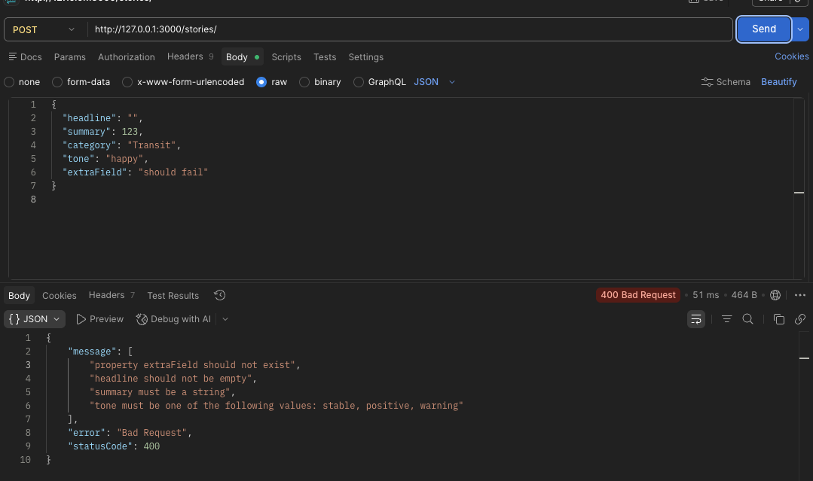

# Reflection
## What is the purpose of pipes in NestJS?
Pipes in NestJS utilise DTOs to apply data validation to incoming data, and can transform data - such as from a string to an int.

## How does ValidationPipe improve API security and data integrity?
ValidationPipe improves API security and data integrity by ensuring incoming data matches expected types and validation rules defined in DTOs. It can strip unknown properties and reject malformed input, reducing the risk of invalid or unexpected data entering the application.

## What is the difference between built-in and custom pipes?
Built-in pipes handle simple and common validation needs - such as validating an email. Custom pipes can check multiple pieces of data and be extended upon to be more customised and widley used.

## How do decorators like @IsString() and @IsNumber() work with DTOs?
These decorators work within DTO classes by establishing validation rules for each property.

# Validation
I used both the global validation pipe and custom DTOs to validate input when trying to add a new story to my news bulliten application - seen within the basic-project folder, under dto and within main.ts. The ValidationPipe uses whitelist which removes properties not defined on the DTO. I made DTOs for validating attempts to update and create new stories, which check data for properties such as headlines (string) and tone (enum). Below is an example of bad data being sent and the error message being return, shown through postman.

