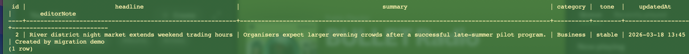
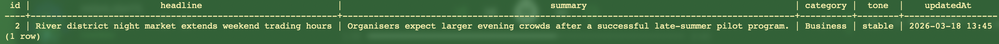

# Reflection
## What is the purpose of database migrations in TypeORM?
The purpose of database migrations in TypeORM is to provide a safe way to update and change database schemas. As opposed to sychronisation, migration allows users a way to roll-back changes if needed, and ensures previous versions of the schema are preserved while updates are applied cleanly.

## How do migrations differ from seeding?
Migration refers to creating or updating the table, while seeding refers to populating the table with starter data.

## Why is it important to version-control database schema changes?
It is important to version-control database scheme changes as to preserve a safe version of the database. This ensures that if the migration causes unexpected issues, a useable and stable version can be easily rolled back to.

## How can you roll back a migration if an issue occurs?
Using the command npx typeorm migration:revert, you can roll back a migration using the TypeORM CLI, which executes the down() method of the most recent migration.

# Using TypeORM migrations & seeding
I have implemented seeding in my basic-project applicaiton within app.service.ts, which seeds sample data into the Stories table if there are no records in there when the application starts. This ensures there is data to view when the application runs.

To implement a migration in this project, I turned off TypeORM synchronize to ensure the schema is controlled only by migrations. Then, I wrote a basic migration that will add an editorNote column to the stories table when run, and remove it again on rollback when down() is executed. Here is the table structure after running the migration to add the editorNote column:

And after running a rollback on the migration:

