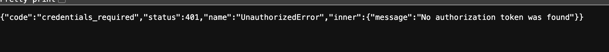
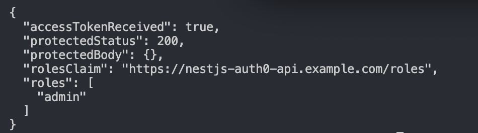

# Reflection
## How does Auth0 handle authentication compared to traditional username/password auth?
Auth0 handles authentication by outsourcing the entire login and identity verification process to a dedicated service, rather than managing it within applications like traditional username/password authentication. With Auth0, users authenticate through a hosted login page, and after successful verification, the service returns secure tokens (such as JWTs) that the application uses to identify and authorize the user. This reduces the need to manage sensitive credentials directly and provides access to advanced features like social login, multi-factor authentication, and single sign-on.

## What is the role of JWT in API authentication?
JWT (JSON Web Tokens) play a key role in API authentication by acting as a secure, self-contained way to verify a user’s identity after they log in. When a user is authenticated (e.g., via Auth0), the server issues a JWT that contains encoded information about the user, such as their ID and permissions. This token is then sent with each request (usually in the Authorization header), allowing the API to verify the user without needing to query a database or maintain a session. Because JWTs are signed, the server can trust that the data hasn’t been tampered with. This makes authentication stateless, scalable, and efficient, especially for modern APIs and distributed systems.

## How do jwks-rsa and public/private key verification work in Auth0?
In Auth0, jwks-rsa is used to verify JWTs using public/private key cryptography rather than a shared secret. When a user logs in, Auth0 signs the JWT with a private key that only it knows. Rather than have this private key, it retrieves the corresponding public key from Auth0’s JWKS endpoint using the jwks-rsa library. If the signature is valid, it proves the token was issued by Auth0 and hasn’t been tampered with. This approach is secure because the private key is never shared, and it also supports key rotation, because Auth0 can expose multiple public keys in the JWKS without breaking your application.

## How would you protect an API route so that only authenticated users can access it?
Typically, a valid JWT (JSON Web Token) must be included with each request and verified before allowing access. In a NestJS application, this is usually done using an authentication guard (e.g., AuthGuard). This guard intercepts incoming requests, extracts the token from the Authorization header, and can validate it via a provider like Auth0. If the token is valid, the request proceeds and the user information is attached to the request; if not, the request is rejected with an unauthorized error. This ensures that only users who have successfully authenticated and possess a valid token can access the protected route.

# Tasks
## Research how Auth0 integrates with NestJS (auth0, @nestjs/jwt, jwks-rsa)
Auth0 handles login and issues signed JWTs, jwks-rsa provides the public key for signature verification, and @nestjs/jwt + guards/strategies in NestJS decode the token and enforce authentication on API routes.

## Understand how JWT-based authentication works
In my application, JWT tokens are created by Auth0 and contain important information about the user - in this context, a user's role. This token is also signed using a secret or private key, then sent back to the client where the guard logic can handle the user's information.

## Explore how Auth0 manages user sessions and access tokens
Auth0 keeps track of whether a user is logged in using its own session, and issues short-lived access tokens that an application uses to authenticate API requests, with optional refresh tokens to maintain access over time.

## Set up a simple authentication flow using Auth0 in a NestJS app
In my nestjs-auth0-api, the API demonstrates a simple authentication flow using Auth0 to confirm a user has the "admin" role before allowing access to the /protected endpoint. This was setup using Auth0 to implement an "on login" action that sends role information about the user in the JWT token, which can then be validated in authorization.guard.ts to allow or prohibit access to the endpoint.

Here is an image of a user with the "admin" role being able to access the /protected page:

And here is the confirmation of a user being able to access the endpoint after having found the admin role is assigned to them:

