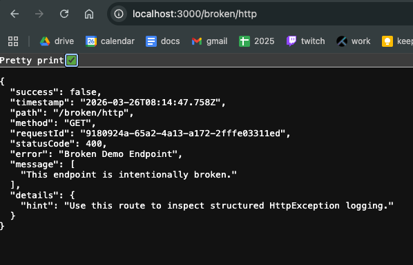
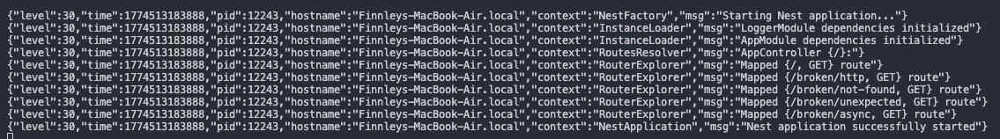

# Reflection
## What are the benefits of using nestjs-pino for logging?
Unlike the default console logger, nestjs-pino outputs logs in JSON for easy parsing and integration with log management tools, supports configurable log levels, and allows contextual logging. It also integrates seamlessly with NestJS, enabling injection of a logger service and automatic HTTP request logging. Thus, nestjs-pino is efficient, scalable, and suitable for both development and production environments, and offers many benefits over the default console logger.

## How does global exception handling improve API consistency?
Global exception handling improves API consistency by centralizing how errors are caught and formatted across the entire application. Instead of having different endpoints or services return thier own errors in inconsistent formats, a global exception filter ensures that all exceptions follow the same structure. This means they can include standardized status codes, messages, and optional metadata, and are logged uniformly. So, the API is more predictable for clients, simplifies error handling on the frontend, and helps developers maintain and debug the application more easily.

## What is the difference between a logging interceptor and an exception filter?
A logging interceptor and an exception filter serve different purposes. A logging interceptor "wraps" around every request and response, and can log details like request method, URL, response status, and timing for observability. Conversely, an exception filter only runs when an error is thrown, catching exceptions and formatting consistent error responses for the client. Essentially, interceptors monitor and log normal operations, while exception filters handle and standardise error handling across the application.

## How can logs be structured to provide useful debugging information?
This can be done by including consistent, meaningful, and machine-readable fields that give context about what happened in the application. Key elements can include timestamp, log level (e.g., info, warn, error), request or correlation ID, user or session information, the source or module of the log, and a clear message describing the event. Structured logs are often formatted in JSON so they can be easily parsed, filtered, and searched in logging systems or monitoring tools. This approach makes it easier to trace issues, understand the flow of requests, and correlate events across services or components.

# Task
I created logging-project to demonstrate using a structered logger (using nestjs-pino), global exception handling, and a custom exception filter. This project has intentionally broken endpoints that trigger different error messages, structured in a readable JSON format. All http requests are formatted and handled the same, using the @nestjs/common.HttpExceptionFilter filter.

**Example of broken endpoint showing a formatted response, useing global exception handling**

**Output of logging - structured in a readable way with nestjs-pino**

