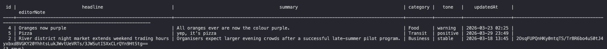

# Reflection
## Why does Focus Bear double encrypt sensitive data instead of relying on database encryption alone?
Double encrypting sensitive data (e.g. with TypeORM) in addition to database encryption provides an extra layer of security in case the database itself is compromised. While database encryption protects data at rest, it is often automatically decrypted when accessed by the database engine, meaning anyone with database access could still read the data. This is particularly important for Focus Bear, where user's sensitive data (such as habits) needs to be stored in order to run the application.

## How does typeorm-encrypted integrate with TypeORM entities?
typeorm-encrypted integrates with TypeORM by letting you add encryption directly to entity columns using decorators, so data is automatically encrypted before being written to the database and decrypted when read back.

## What are the best practices for securely managing encryption keys?
Encryption keys should be managed securely by keeping them out of source code and storing them in environment variables or, preferably, dedicated secret management services. Access to keys should follow the principle of least privilege, ensuring only authorised services/users can access them. Keys should be rotated regularly to reduce the impact of potential leaks, and they should be kept separate from the encrypted data to avoid a single point of compromise. Also, keys should be protected in transit using secure protocols and never exposed in logs or error messages.

## What are the trade-offs between encrypting at the database level vs. the application level?
Encrypting at the database level and at the application level each have different trade-offs. Database-level encryption is easier to implement and has minimal impact on application code, but it only protects data “at rest” and is automatically decrypted by the database engine. This means anyone with database access can still read it. In contrast, application-level encryption (e.g., using libraries like typeorm-encrypted) encrypts data before it reaches the database. This means that even if the database is compromised, the data remains unreadable without the application’s keys. However, this approach adds complexity, requires careful key management, and limits features like querying, indexing, or searching on encrypted fields. Thus, many systems use both approaches together to balance ease of use with stronger security.

# Tasks
## How are encryption keys are managed and stored?
Encryption keys are managed and stored separately from application code and data to keep them secure. In practice, they are kept in environment variables for simple setups or, more securely, in dedicated secret management systems.

## typeorm-encrypted and testing encrypting and decrypting a database field
To test encryptinng and decrypting a database field, I impleneted a typeorm-encrypted example on the editorNote field from my Story database in my basic-project.

In the image below, you can see the one record with data in editorNote has this data encrypted and displays as ciphertext:

On the dashboard web interface, the data is decrypted and shown as plain text:

