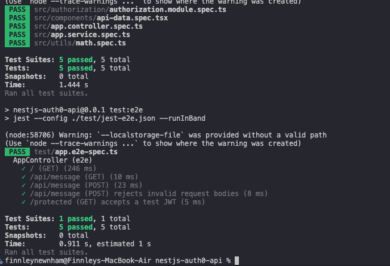

# Reflection
## How does Supertest help test API endpoints?
Supertest is a Node.js library that allows developers to write automated tests for HTTP servers, such as API endpoints in a NestJS application. It works by sending simulated HTTP requests to the server and letting you assert on the responses, including status codes, headers, and JSON payloads, which helps ensure that endpoints behave correctly.

## What is the difference between unit tests and API tests?
The main difference between unit tests and API tests is in their scope and focus. Unit tests target a single component, function, or class in isolation, verifying that it behaves correctly with controlled inputs and mocked dependencies. API tests, conversely, test the application’s endpoints from the perspective of an external client, checking that HTTP requests return the correct status codes, headers, and data. Therefore unit tests focus on internal correctness, while API tests focus on end-to-end behavior of the system as a whole.

## Why should authentication be mocked in integration tests?
Authentication should be mocked in integration tests to isolate the behavior of the system you’re testing and avoid unnecessary complexity or failures caused by external dependencies. Real authentication often involves token generation, verification, database lookups, or calls to external identity providers, which can be slow, unreliable, or difficult to reproduce consistently in a test environment. By mocking authentication, you can simulate different user roles or permissions in a controlled way, ensuring that your tests focus solely on the functionality of the endpoints, services, or business logic.

## How can you structure API tests to cover both success and failure cases?
To structure API tests that cover both success and failure cases, you should design each test to target a specific scenario and clearly define the expected outcome - for both succesful and unsuccessful results.

# Tasks
## Research how Supertest is used for API testing in NestJS
I have demonstrated this in the above reflection.

## Write an integration test for a simple GET API endpoint & for a POST API endpoint with request validation
This has been done in app.e2e-spec.ts in my nestjs-auth0-api project. GET and POST endpoints are tested, with request validation happening when testing POST /message with invalid { message: '' }, returning a 400.

## Mock authentication in API tests (e.g., by providing a test JWT)
I have mocked authentication by testing GET /protected, which sends Authorization: Bearer test-admin-jwt in app.e2e-spec.ts. This checks that the request is allowed and returns the protected response.

Below is the results from the tests:

