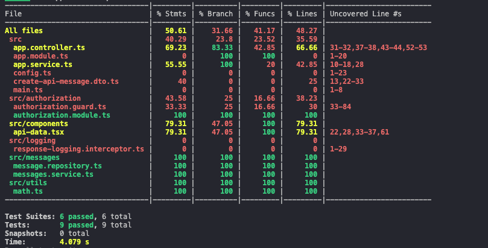

# Reflection
## What does the coverage bar track, and why is it important?
The coverage bar tracks how much of the code is exercised by tests. It measures several metrics, including the percentage of statements, branches (like if/else), functions, and lines that have been executed during testing. Coverage is important because it helps identify untested parts of an application, ensuring that key logic, edge cases, and potential failure points are actually being verified.

## Why does Focus Bear enforce a minimum test coverage threshold?
By enforcing a minimum test coverage threshold, we can ensure the codebase is thouroughly tested and working as intended. By minimising the amount of un-tested code, the number of bugs and unexpected failures should be reduced.

## How can high test coverage still lead to untested functionality?
High test coverage can still lead to untested functionality because coverage only measures which lines of code are executed, not whether all possible behaviors, inputs, or edge cases are properly tested. So, you can have a high test coverage by making sure all your functions are being tested, but unless all outcomes and edge cases within those functions are being triggered, you are not actually testing a high percentage of your code.

## What are examples of weak vs. strong test assertions?
eak test assertions are those that only verify minimal conditions, such as whether a function exists, a value is defined, or an array has any elements, without checking whether the code actually behaves correctly. For example, asserting that result is defined or that a function is truthy does not guarantee the logic produced the expected outcome. Strong test assertions verify the precise behavior, output, or side effects of the code. This includes checking that a function returns the exact expected value, that an object contains the correct data, or that a mock service was called with the right arguments. Strong assertions are more reliable because they catch errors, incorrect logic, and unintended side effects, whereas weak assertions may pass even if the code is broken or producing wrong results.

## How can you balance increasing coverage with writing effective tests?
Balancing increasing coverage with writing effective tests means focusing not just on the quantity of code executed, but on the quality and meaningfulness of your tests. High coverage alone doesn’t guarantee your code is well-tested—tests must verify behavior, edge cases, and expected outcomes. To achieve this balance, start by identifying critical paths, complex logic, and edge cases in your application and write strong assertions for them.

# Tasks
## Research how Jest generates test coverage reports in NestJS
In NestJS, Jest generates test coverage reports by instrumenting your code before running the tests and tracking which lines, branches, functions, and statements are executed.

## Run the test suite and view the test coverage report
Here is my report:

## Research the concept of "meaningful test assertions" and why high coverage can sometimes be misleading
As addressed in the above reflection.

## Refactor a weak test to ensure it has proper assertions
I created a weak test in app.service.spec.ts:
expect(appService.createApiMessage({ message: 'Hello!' })).toBeTruthy();

This is a weak test as it would still pass if the method returned the wrong message object; it doesn't verify the actual behaviour.

I then refactored it to:

expect(appService.createApiMessage(message)).toEqual({
  message: 'Hello!',
});

This has a proper assertion, ensuring that exactly "Hello!" is returned, and it documents the expected behaviour clearly.
