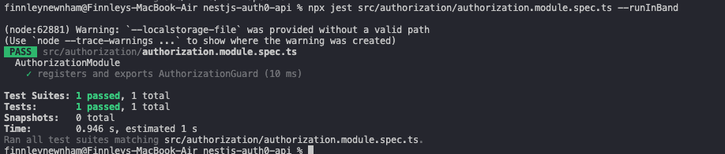

# Reflection
## What are the key differences between unit, integration, and E2E tests?
Unit, integration, and end-to-end (E2E) tests differ in scope and purpose. Unit tests check individual functions or components in isolation to ensure they work correctly. Integration tests verify that multiple units or modules work together as expected, such as a service interacting with an API or database. E2E tests simulate the full application workflow from a user’s perspective, testing real interactions across the entire system.

## Why is testing important for a NestJS backend?
Testing is important for a NestJS backend because it ensures that your application’s business logic, controllers, and services work correctly and consistently. NestJS applications often involve multiple layers (controllers, services, and external dependencies like databases or APIs) so tests help catch bugs early, verify that modules interact correctly, and prevent regressions when code changes

## How does NestJS use @nestjs/testing to simplify testing?
NestJS uses the @nestjs/testing package to simplify testing by providing utilities to create test modules that mimic your real application modules.

## What are the challenges of writing tests for a NestJS application?
Writing tests for a NestJS application comes with a lot of challenges, due to its modular architecture and use of dependency injection. One common challenge is mocking dependencies correctly, as services often depend on other services, repositories, or external APIs. Thus, setting up realistic mocks without breaking tests can be difficult. A further issue is testing asynchronous code. Since many NestJS services involve database calls, HTTP requests, or event-driven logic, careful handling of promises or observables is required. Ensuring proper module setup in tests can also be complex, particularly when testing modules with many providers, guards, or interceptors. Lastly, integration testing with databases or external services can be slow, flaky, or require special configurations, making it harder to maintain reliable automated tests.

# Tasks
## Research the different types of testing in NestJS (Unit, Integration, E2E)
As outlined above, Unit, integration, and end-to-end (E2E) tests differ in scope and purpose.

## Understand the role of Jest in NestJS testing
Jest works as the testing framework for NestJS applications, providing tools for writing and running tests, making assertions, and mocking dependencies. It allows developers to write unit, integration, and E2E tests in a consistent way.

## Explore how to test NestJS modules using @nestjs/testing & run a sample test using Jest
In my nestjs-auth0-api project, I set up a test for AuthorizationModule using @nestjs/testing and Jest. Below is the console output after running the test:

