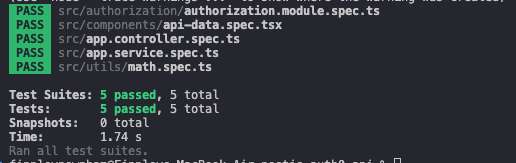

# Reflection
## Why is it important to test services separately from controllers?
It’s important to test services separately from controllers because they serve different roles within the application architecture. Controllers are responsible for handling HTTP requests and shaping responses, while services contain the core business logic. Seperating tests improves clarity, reduces fragile tests, and makes it easier to identify where issues originate, thus leading to a more maintainable and reliable codebase.

## How does mocking dependencies improve unit testing?
Mocking dependencies improves unit testing by allowing you to isolate the specific code you want to test and remove external factors that could interfere with the results. By replacing real services, databases, or APIs with controlled mock versions, you can provide predictable inputs and outputs, making tests faster, more reliable, and easier to understand.

## What are common pitfalls when writing unit tests in NestJS?
One common pitfall istesting too much at once, such as combining controllers, services, and database logic in a single test. This makes failures hard to diagnose. Another pitfall is not properly mocking dependencies, leading tests to depend on real databases, APIs, or other services, which makes them slow, flaky, or inconsistent. Over-mocking is also a risk—if you mock too much, your tests may no longer reflect real behavior, giving false confidence.

## How can you ensure that unit tests cover all edge cases?
To ensure unit tests cover all edge cases, you need a systematic approach. Start by analyzing the function or module and identifying all possible scenarios, including typical inputs, boundary values, invalid inputs, and error conditions. For example, test empty inputs, very large numbers, null or undefined values, and unexpected types. You should consider both positive cases and negative cases.

# Tasks
## Research how unit testing works in NestJS using Jest
Unit testing in NestJS uses Jest as the default testing framework. Jest provides utility for mocking dependencies, running tests in parallel, and generating code coverage reports. In NestJS, you can create a testing module that mimics the structure of your application and allows you to inject services and controllers for testing, using Jest to help mock dependencies.

## Write a unit test for a NestJS service & controller method & mock dependencies using jest.mock()
My tests within my nestjs-auth0-api project demonstrate each of these. authorization.module.spec.ts uses jest.mock() to test the NestJS dependency-injection setup for the authorization feature. In app.service.spec.ts, the method AppService.getApiMessage() is tested. In app.controller.spec.ts the AppController.getHello() method is tested and checks that it returns "Hello World!".

All tests pass, with the following results:

