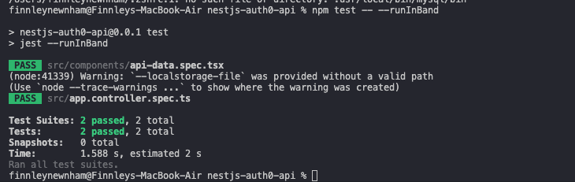

# Reflection
## Why is it important to mock API calls in tests?
Mocking API calls in tests is important because it lets you test your code in isolation, safely, and reliably without depending on external systems. Real APIs can be slow, unreliable, or change unexpectedly, which can make tests flaky or slow. By mocking API calls, you control the responses—success, errors, or edge cases—so you can check that your component or service behaves correctly in all scenarios.

## What are some common pitfalls when testing asynchronous code?
Testing asynchronous code comes with its own pitfalls, such as the test runner finishing before the async operation completes, or the possibility of you misinterpreting timing and results.

# Tasks
## Create a React component that fetches and displays data from an API.
My nestjs-auth0-api project now includes a React component at api-data.tsx that fetches JSON from an API endpoint and renders loading, error, or success state.

## Write a Jest test that mocks the API call and verifies the component’s behavior.
I also added a Jest test at api-data.spec.tsx that mocks fetch, renders the component, and verifies the mocked response message appears. Below is the console output after running these tests:

