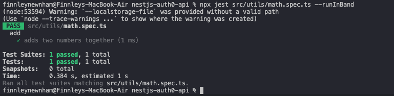

# 9.2

## Reflection
### Why is it important to mock API calls in tests?
Mocking API calls in tests is important because it lets you test your code in isolation, safely, and reliably without depending on external systems. Real APIs can be slow, unreliable, or change unexpectedly, which can make tests flaky or slow. By mocking API calls, you control the responses—success, errors, or edge cases—so you can check that your component or service behaves correctly in all scenarios.

### What are some common pitfalls when testing asynchronous code?
Testing asynchronous code comes with its own pitfalls, such as the test runner finishing before the async operation completes, or the possibility of you misinterpreting timing and results.

## Tasks
### Create a React component that fetches and displays data from an API.
My nestjs-auth0-api project now includes a React component at api-data.tsx that fetches JSON from an API endpoint and renders loading, error, or success state.

### Write a Jest test that mocks the API call and verifies the component’s behavior.
I also added a Jest test at api-data.spec.tsx that mocks fetch, renders the component, and verifies the mocked response message appears. Below is the console output after running these tests:

# 9.4
## Reflection
### Why is automated testing important in software development?
Automated testing is important in software development because it ensures that code works correctly, consistently, and efficiently without requiring a developer to manually check everything every time. By writing tests that run automatically, developers can quickly detect bugs, regressions, or unintended side effects whenever code changes, which makes maintaining and refactoring code safer and faster.

### What did you find challenging when writing your first Jest test?
Though I've worked with unit testing before, I have not used JavaScript testing frameworks previously, so it was challenging trying to understand how to set up the test environment and write tests that properly mock API calls. Thus, it took some time to get familiar with Jest's syntax and features.

## Tasks
### What is Jest and why are unit tests important?
Jest is a JavaScript testing framework that allows developers to write and run tests for their code, providing tools for assertions, mocking functions, and testing asynchronous operations. Unit tests are important because they check that individual pieces of code—like functions or methods—work correctly in isolation.

### Set up Jest in your React project & write a simple test for a utility function
Setting up Jest and React was done for the previous task in 9.2, where I wrote a test for the API data fetching component. I added a basic utility function to test adding two numbers, which passed with the output shown below:

